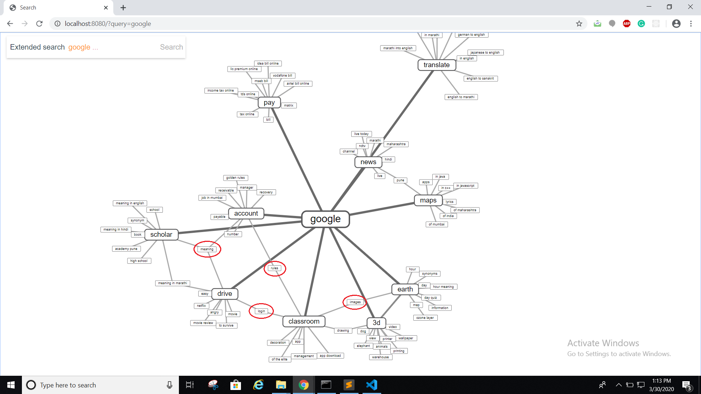
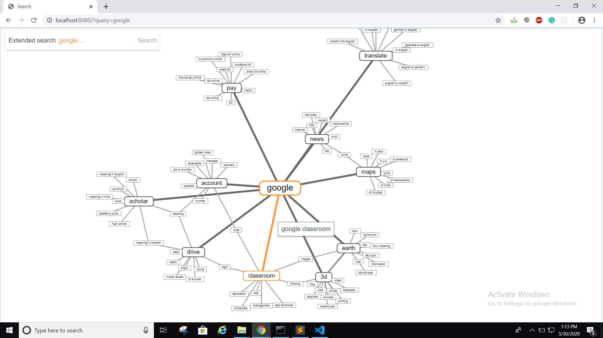

# search-pattern
A relation of search queries when searched with google search. It gives an extended relation between search performed by google and interconnection between results at an extra depth.

See the application live in action on https://shashank-google-search.netlify.com/

Steps to run the app.
1. Go to the base folder and run ```npm install``` to install the node dependencies.
2. Run ```npm start``` to start the application.
3. Go to http://localhost:8080/ to see the application in action.
4. Type any word in the search bar an enter to see the results. You'll see a graph of connected objects in a format which resembles what Google's auto suggestion gives you a result based on your input.
5. The first level auto-suggestions are then put as input and these results are obtained and connected back into the visual output.

The image below shows the results when a user enters a query. The words highlighted in the red circle are the common results for multiple search terms.



The link in orange shows the Google search term that is connected. On clickng this link, user will be directed to the actual Google search page

